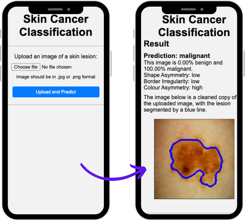

# Skin Lesion Classification Web Application

A Flask-based web application that uses machine learning to classify skin lesions as benign or malignant. The application implements the ABCD rule (Asymmetry, Border irregularity, Color variation, Diameter) for dermatological analysis and provides detailed feature analysis of uploaded skin lesion images.

## 🔬 Project Overview

This application leverages computer vision and deep learning techniques to analyze skin lesion images and provide:
- **Binary classification**: Benign vs Malignant prediction with confidence scores
- **ABCD feature analysis**: Detailed breakdown of dermatological features
- **Image preprocessing**: Hair removal and lesion segmentation
- **Visual feedback**: Contoured lesion visualization

### Key Features

- **Machine Learning Model**: Uses a quantized EfficientNet-B3 TensorFlow Lite model for efficient inference
- **Image Processing Pipeline**: Comprehensive preprocessing including hair removal, lesion segmentation, and feature extraction
- **ABCD Analysis**: 
  - **Asymmetry**: Horizontal and vertical dissymmetry analysis
  - **Border**: Irregularity measurement using compactness index
  - **Color**: Variance, intensity, and asymmetry in LAB color space
  - **Diameter**: Lesion size measurement
- **Web Interface**: User-friendly Flask web application with image upload and results visualization

## 📸 Application Interface



*The web application provides an intuitive interface for uploading skin lesion images and viewing detailed classification results with ABCD feature analysis.*

## 🏗️ Project Structure

```
web_pred_app/
├── app.py                      # Main Flask application
├── prediction.py               # ML model inference and prediction logic
├── helpers.py                  # Image processing and feature extraction utilities
├── class_effb3_quant.tflite   # Quantized EfficientNet-B3 model
├── requirements.txt            # Python dependencies
├── docs/                       # Documentation assets
│   └── images/                # Screenshots and documentation images
│       └── app_screenshot.png # Application interface screenshot
├── templates/                  # HTML templates
│   ├── index.html             # Upload page
│   └── predict.html           # Results page
├── static/                     # Static assets
│   ├── styles.css             # Application styling
│   └── images/                # Processed images storage
├── sample_images/              # Test images (ISIC dataset samples)
├── Dockerfile                  # Docker container configuration
├── compose.yaml               # Docker Compose configuration
├── heroku.yml                 # Heroku deployment configuration
└── README.md                  # This file
```

## 🚀 Quick Start

### Prerequisites

- Python 3.7+
- pip (Python package manager)
- Virtual environment (recommended)

### Local Development Setup

1. **Clone the repository**
   ```bash
   git clone https://github.com/Uniqcoda/web_pred_app.git
   cd web_pred_app
   ```

2. **Create and activate virtual environment**
   ```bash
   python3 -m venv .venv
   source .venv/bin/activate  # On Windows: .venv\Scripts\activate
   ```

3. **Install dependencies**
   ```bash
   pip install -r requirements.txt
   ```

4. **Run the application**
   ```bash
   flask run
   ```

5. **Access the application**
   - Open your browser and navigate to `http://localhost:5000`
   - Upload a skin lesion image using the provided interface
   - View the classification results and feature analysis

### Quick Setup (One-liner)
```bash
python3 -m venv .venv && source .venv/bin/activate && pip install -r requirements.txt && flask run
```

## 🐳 Docker Deployment

### Using Docker Compose (Recommended)
```bash
docker compose up --build
```

### Using Docker directly
```bash
docker build -t skin-lesion-app .
docker run -p 5000:5000 skin-lesion-app
```

## 🌐 Production Deployment

### Local Production Server
```bash
gunicorn --workers=4 --bind 0.0.0.0:5000 app:app
```

### Heroku Deployment
The application is configured for Heroku deployment with `heroku.yml`. Simply connect your Heroku app to this repository and enable automatic deployments.

## 🧪 Testing the Application

Sample images are provided in the `/sample_images` directory. These are real dermatoscopic images from the ISIC (International Skin Imaging Collaboration) dataset that you can use to test the application:

- `ISIC_0024334.jpg`
- `ISIC_0034106.jpg` 
- `ISIC_3519356.jpg`
- `ISIC_9997917.jpg`

## 🔧 Technical Details

### Machine Learning Pipeline

1. **Image Preprocessing** (`helpers.py`):
   - Hair removal using morphological operations and inpainting
   - Lesion segmentation using Otsu thresholding and contour detection
   - Feature extraction following the ABCD dermatological criteria

2. **Model Inference** (`prediction.py`):
   - Uses a quantized EfficientNet-B3 model for efficient inference
   - Input shape: 224x224x3 RGB images
   - Output: Binary classification probability (0-1 scale)

3. **Feature Analysis**:
   - **Asymmetry**: Calculated by comparing horizontal/vertical flipped versions
   - **Border Irregularity**: Inverse compactness index (P²/4πA)
   - **Color Features**: Variance and asymmetry in LAB color space
   - **Diameter**: Minimum enclosing circle diameter

### Dependencies

- **Flask**: Web framework for the application interface
- **OpenCV**: Computer vision library for image processing
- **NumPy**: Numerical computing for array operations
- **TensorFlow**: Machine learning framework for model inference
- **Gunicorn**: WSGI HTTP server for production deployment

### Configuration Constants

Key parameters that can be adjusted in `helpers.py`:
- `MIN_CONTOUR_AREA = 700`: Minimum lesion area for detection
- `ASYMMETRY_THRESHOLD = 8`: Minimum area for asymmetry calculation
- `MAX_CONT_DISTANCE_RATIO = 0.4`: Maximum distance from image center for lesion detection

## 🤝 Contributing

1. Fork the repository
2. Create a feature branch (`git checkout -b feature/amazing-feature`)
3. Commit your changes (`git commit -m 'Add some amazing feature'`)
4. Push to the branch (`git push origin feature/amazing-feature`)
5. Open a Pull Request

## 📝 API Endpoints

- `GET /`: Home page with image upload interface
- `POST /predict`: Image classification endpoint
  - Accepts: `multipart/form-data` with `image` field
  - Returns: HTML page with classification results and feature analysis

## ⚠️ Important Notes

- **Medical Disclaimer**: This application is for educational and research purposes only. It should not be used as a substitute for professional medical diagnosis.
- **Image Requirements**: Best results with dermatoscopic images similar to ISIC dataset format
- **Performance**: The quantized model provides a good balance between accuracy and inference speed
- **Storage**: Uploaded images are temporarily stored in `static/images/` directory

## 🐛 Troubleshooting

### Common Issues

1. **"Lesion has not been detected"**: 
   - Ensure the image contains a clear, centered lesion
   - Try images with better contrast or lighting
   - Check that the lesion is not too small (< 700 pixels area)

2. **Import errors**:
   - Verify all dependencies are installed: `pip install -r requirements.txt`
   - Ensure you're using the correct Python version (3.7+)

3. **Model loading issues**:
   - Confirm `class_effb3_quant.tflite` file is present in the root directory
   - Check TensorFlow installation: `python -c "import tensorflow as tf; print(tf.__version__)"`

## 📊 Model Performance

The EfficientNet-B3 model has been quantized for optimal performance:
- **Model Size**: Significantly reduced from full precision version
- **Inference Speed**: Optimized for real-time web application use
- **Accuracy**: Maintains competitive performance on skin lesion classification tasks

## 🔗 Related Resources

- [ISIC Archive](https://www.isic-archive.com/): International Skin Imaging Collaboration
- [EfficientNet Paper](https://arxiv.org/abs/1905.11946): Original EfficientNet architecture
- [ABCD Rule](https://en.wikipedia.org/wiki/ABCDE_rule): Dermatological assessment criteria

---

**Repository**: [https://github.com/Uniqcoda/web_pred_app.git](https://github.com/Uniqcoda/web_pred_app.git)
